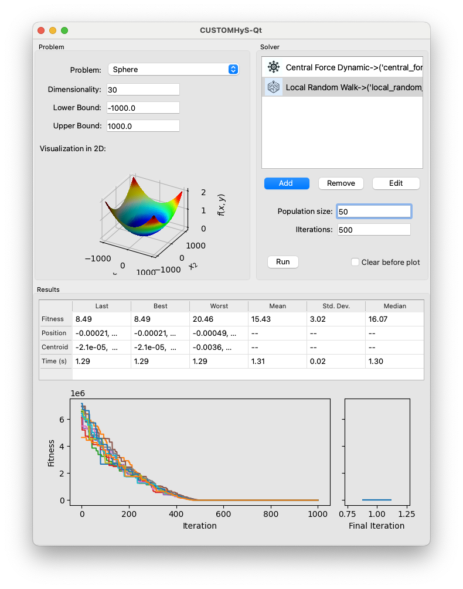

# CUSTOMHyS-Qt

This is the official repository for the CUSTOMHyS-Qt software. CUSTOMHyS-Qt is a GUI for the CUSTOMHyS framework, which is an interactive tool for customysing heuristic-based algorithms. The CUSTOMHyS-Qt is written in Python and uses the PyQt5 library for the GUI. Further references about the backend can be found in the [CUSTOMHyS repository](https://github.com/jcrvz/CUSTOMHyS). The CUSTOMHyS-Qt is distributed under the terms of the GNU General Public License v3.0.

## Screenshot(s)

